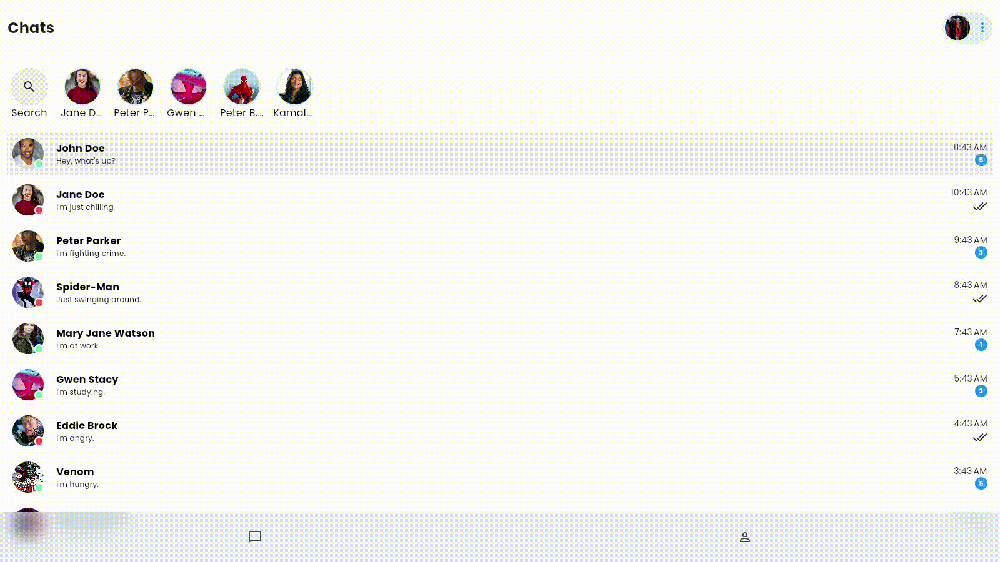
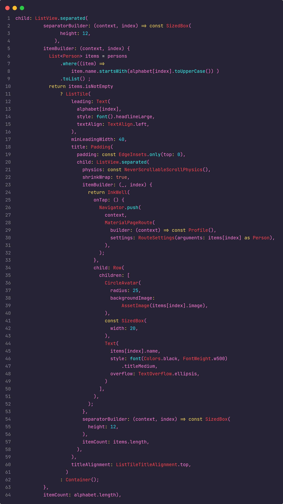

# Chat-App 
📱
_Bem-vindo à documentação do Chat-App. Um aplicativo de chat com um layout elegante, desenvolvido em Flutter para aprimorar habilidades de design e UI._



---

## Menu

- [Sobre o Projeto](#sobre-o-projeto)
- [Tecnologias Utilizadas](#tecnologias-utilizadas)
- [Pacotes Utilizadas](#pacotes-utilizadas)
- [Destaque](#destaque)
- [Como Usar](#como-usar)
- [Funcionalidades](#funcionalidades)
- [Contribuição](#contribuição)
- [Redes Sociais](#redes-sociais)
- [Licença](#licença)
- [Referência](#referência)

---

## Sobre o Projeto

O Chat-App é uma aplicação de chat minimalista desenvolvida para praticar design de interfaces de usuário em Flutter. Este projeto foi criado para aprimorar habilidades de layout e proporcionar uma experiência de usuário intuitiva e agradável.

## Tecnologias Utilizadas


## Pacotes Utilizadas

- **intl:** Pacote para formatação de datas e números.
- **cupertino_icons:** Ícones no estilo iOS para a interface do usuário.

## Destaque



## Como Usar

1. **Instale o Projeto:**

   ```bash
   git clone https://github.com/GUSTAV0DEDEUS/Chat_APP.git
   cd chat_app
   ```

2. **Execute a Aplicação:**

   ```bash
   flutter run
   ```

3. **Explore o Layout:**

   Abra o aplicativo e explore o design elegante e minimalista do Chat-App.

## Funcionalidades

- **Lista de Conversas:** Veja uma lista de conversas simuladas com diferentes usuários.
- **Detalhes da Conversa:** Ao clicar em uma conversa, veja detalhes da conversa com mensagens simuladas.
- **Layout Responsivo:** O design é responsivo para diferentes tamanhos de tela.

## Contribuição

Sinta-se à vontade para contribuir para o desenvolvimento deste projeto ou relatar problemas. Abra uma issue ou envie um pull request para o [repositório no GitHub](https://github.com/GUSTAV0DEDEUS/Chat_APP.git).

## Redes Sociais

[](https://www.linkedin.com/in/gustavo-de-deus-conceicao/)
[](https://github.com/GUSTAV0DEDEUS)
[](https://www.instagram.com/decode0001/)
<a href="https://www.youtube.com/@deCode001">
  
</a>

## Licença

Este projeto é licenciado sob a [Licença MIT](./LICENSE).

---

## Referência

Este projeto foi desenvolvido com base em um layout disponivel no site dribble [aqui](https://dribbble.com/shots/18944778-Beauty-Salon-Appointment-Service).